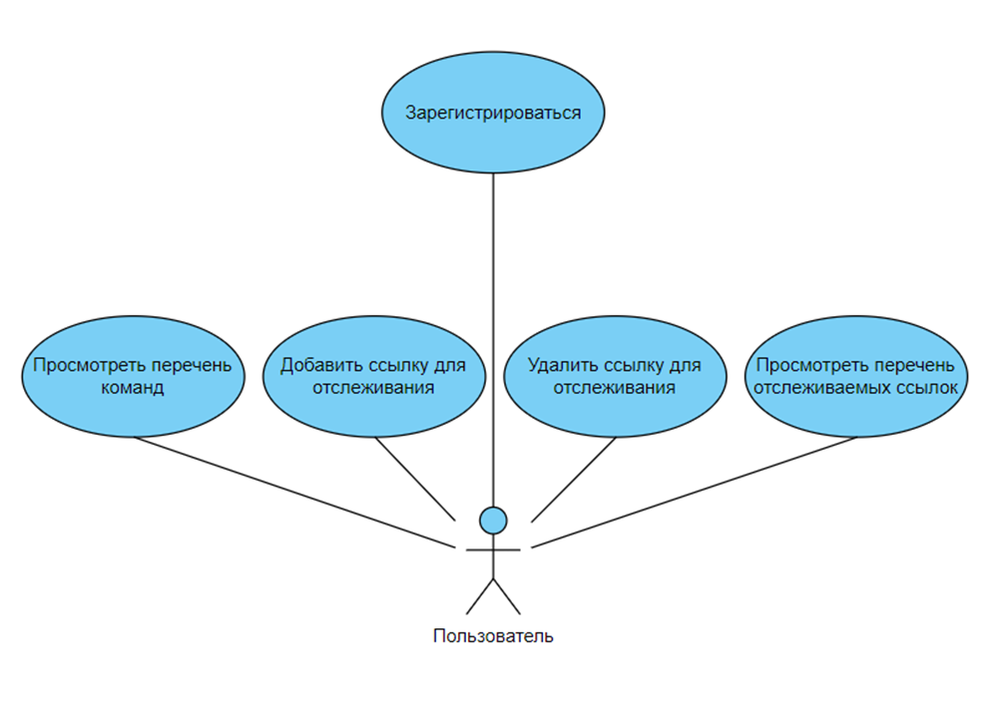

# Telegram-бот для отслеживания обновлений контента по ссылкам

## УЧАСТНИКИ ПРОЕКТА  
Олейникова Анастасия Денисовна 5130202/20201  
Щербинина Дарья Вячеславовна 5130202/20201

## ЭТАПЫ
### ОПРЕДЕЛЕНИЕ ПРОБЛЕМЫ
Некоторые важные для IT-специалиста сайты, например, GitHub и StackOverflow,
не имеют системы уведомлений, соответствующей современным критериям удобства.
Пользователь вынужден регулярно вручную проверять каждую веб-страницу
по-отдельности, чтобы отследить изменения, что неудобно, времязатратно
и увеличивает вероятность пропустить изменения.

### ВЫРАБОТКА ТРЕБОВАНИЙ
Действующие лица:
1.	Пользователь.  

Варианты использования:
1.	Зарегистрироваться;
2.	Просмотреть перечень команд;
3.	Добавить ссылку для отслеживания;
4.	Удалить ссылку для отслеживания;
5.	Просмотреть перечень отслеживаемых ссылок.

Сценарии вариантов использования:

I) **Зарегистрироваться**.  
Основное действующее лицо: пользователь.  
Триггер: пользователь ввел команду /start.  
Гарантия успеха: пользователь зарегистрировался в системе.  
Основной сценарий:
1.	Система регистрирует пользователя;
2.	Система отправляет приветственное сообщение,
сигнализируя об успешном завершении регистрации и готовности к работе.  

Расширения: отсутствуют.

II)	**Просмотреть перечень команд**.  
Основное действующее лицо: пользователь.  
Триггер: пользователь ввел команду /help.  
Гарантия успеха: пользователь получил сообщение с перечнем команд.  
Основной сценарий:
1.	Система отправляет сообщение с перечнем команд.

Расширения: отсутствуют.

III) **Добавить ссылку для отслеживания**.  
Основное действующее лицо: пользователь.  
Триггер: пользователь ввел команду /track в формате /track <ссылка>.  
Гарантия успеха: пользователь получил сообщение о начале отслеживания ссылки,
ссылка появилась в перечне отслеживаемых ссылок.  
Основной сценарий:
1.	Система начинает отслеживать данную ссылку;
2.	Система отправляет сообщение о начале отслеживания ссылки.

Расширения:  
1.а. Данная ссылка ведет на не определенный в системе ресурс;  
    1.а.1. Система отправляет сообщение о некорректности ссылки
    и предлагает пользователю проверить ссылку и попробовать еще раз;  
1.б. Данная ссылка уже отслеживается;  
    1.б.1. Система отправляет сообщение о том, что ссылка уже отслеживается.

IV)	**Удалить ссылку для отслеживания**.  
Основное действующее лицо: пользователь.  
Триггер: пользователь ввел команду /untrack в формате /untrack <ссылка>.  
Гарантия успеха: пользователь получил сообщение о прекращении отслеживания ссылки,
ссылка исчезла из перечня отслеживаемых ссылок.  
Основной сценарий:  
1.	Система прекращает отслеживать данную ссылку;
2.	Система отправляет сообщение о прекращении отслеживания ссылки.

Расширения:  
1.а. Данная ссылка не отслеживалась ранее;  
1.а.1. Система отправляет сообщение о некорректности ссылки
и предлагает пользователю проверить ссылку и попробовать еще раз.

V) **Просмотреть перечень отслеживаемых ссылок**.  
Основное действующее лицо: пользователь.  
Триггер: пользователь ввел команду /list.  
Гарантия успеха: пользователь получил сообщение с перечнем отслеживаемых ссылок.  
Основной сценарий:
1.	Система отправляет сообщение с перечнем отслеживаемых ссылок.

Расширения:  
1.а. Перечень отслеживаемых ссылок пуст;  
1.а.1. Система отправляет сообщение о том, что список отслеживаемых ссылок пуст.

### РАЗРАБОТКА АРХИТЕКТУРЫ И ДЕТАЛЬНОЕ ПРОЕКТИРОВАНИЕ

### КОДИРОВАНИЕ И ОТЛАДКА

### UNIT ТЕСТИРОВАНИЕ

### ИНТЕГРАЦИОННОЕ ТЕСТИРОВАНИЕ

### СБОРКА