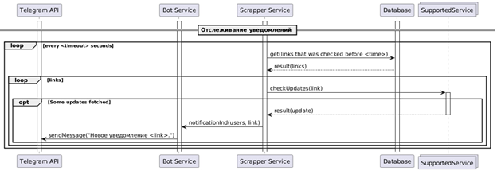

# Telegram-бот для отслеживания обновлений контента по ссылкам

## УЧАСТНИКИ ПРОЕКТА  
Олейникова Анастасия Денисовна 5130202/20201  
Щербинина Дарья Вячеславовна 5130202/20201

## ОПРЕДЕЛЕНИЕ ПРОБЛЕМЫ
Некоторые важные для IT-специалиста сайты, например, GitHub и StackOverflow,
не имеют системы уведомлений, соответствующей современным критериям удобства.
Пользователь вынужден регулярно вручную проверять каждую веб-страницу
по-отдельности, чтобы отследить изменения, что неудобно, времязатратно
и увеличивает вероятность пропустить изменения.

## ВЫРАБОТКА ТРЕБОВАНИЙ
Действующие лица:
1.	Пользователь.  

Варианты использования:
1.	Зарегистрироваться;
2.	Просмотреть перечень команд;
3.	Добавить ссылку для отслеживания;
4.	Удалить ссылку для отслеживания;
5.	Просмотреть перечень отслеживаемых ссылок.


Сценарии вариантов использования:

I) **Зарегистрироваться**.  
Основное действующее лицо: пользователь.  
Триггер: пользователь ввел команду /start.  
Гарантия успеха: пользователь зарегистрировался в системе.  
Основной сценарий:
1.	Система регистрирует пользователя;
2.	Система отправляет приветственное сообщение,
сигнализируя об успешном завершении регистрации и готовности к работе.  

Расширения: отсутствуют.

II)	**Просмотреть перечень команд**.  
Основное действующее лицо: пользователь.  
Триггер: пользователь ввел команду /help.  
Гарантия успеха: пользователь получил сообщение с перечнем команд.  
Основной сценарий:
1.	Система отправляет сообщение с перечнем команд.

Расширения: отсутствуют.

III) **Добавить ссылку для отслеживания**.  
Основное действующее лицо: пользователь.  
Триггер: пользователь ввел команду /track в формате /track <ссылка>.  
Гарантия успеха: пользователь получил сообщение о начале отслеживания ссылки,
ссылка появилась в перечне отслеживаемых ссылок.  
Основной сценарий:
1.	Система начинает отслеживать данную ссылку;
2.	Система отправляет сообщение о начале отслеживания ссылки.

Расширения:  
1.а. Данная ссылка ведет на не определенный в системе ресурс;  
    1.а.1. Система отправляет сообщение о некорректности ссылки
    и предлагает пользователю проверить ссылку и попробовать еще раз;  
1.б. Данная ссылка уже отслеживается;  
    1.б.1. Система отправляет сообщение о том, что ссылка уже отслеживается.

IV)	**Удалить ссылку для отслеживания**.  
Основное действующее лицо: пользователь.  
Триггер: пользователь ввел команду /untrack в формате /untrack <ссылка>.  
Гарантия успеха: пользователь получил сообщение о прекращении отслеживания ссылки,
ссылка исчезла из перечня отслеживаемых ссылок.  
Основной сценарий:  
1.	Система прекращает отслеживать данную ссылку;
2.	Система отправляет сообщение о прекращении отслеживания ссылки.

Расширения:  
1.а. Данная ссылка не отслеживалась ранее;  
1.а.1. Система отправляет сообщение о некорректности ссылки
и предлагает пользователю проверить ссылку и попробовать еще раз.

V) **Просмотреть перечень отслеживаемых ссылок**.  
Основное действующее лицо: пользователь.  
Триггер: пользователь ввел команду /list.  
Гарантия успеха: пользователь получил сообщение с перечнем отслеживаемых ссылок.  
Основной сценарий:
1.	Система отправляет сообщение с перечнем отслеживаемых ссылок.

Расширения:  
1.а. Перечень отслеживаемых ссылок пуст;  
1.а.1. Система отправляет сообщение о том, что список отслеживаемых ссылок пуст.

## РАЗРАБОТКА АРХИТЕКТУРЫ И ДЕТАЛЬНОЕ ПРОЕКТИРОВАНИЕ
### Характер нагрузки на сервис
Для оценки нагрузки необходимо ввести ряд допущений. Допустим, мы имеем
10 000 пользователей в сутки, ограничение в 10 отслеживаемых ссылок на каждого
пользователя, и храним данные 5 лет.

#### Соотношение R/W нагрузки:  
- Read: ~70% (проверка обновлений, чтение ссылок из БД);  
- Write: ~30% (регистрация, добавление/удаление ссылок,
обновление временных меток, рассылка уведомлений).

#### Объемы трафика:  
~10 000 пользователей; каждый пользователь отслеживает ~10 ссылок, ссылки проверяются каждые 60 минут =>  
- ~2 400 000 запросов/сутки (Scrapper → GitHub/StackOverflow);
- Оценка количества отправляемых сообщений зависит от наличия обновлений по отслеживаемым ссылкам. Допустим, что по каждой ссылке есть по 1 обновлению, тогда ~100 000 сообщений/сутки (Bot → Telegram API).

#### Объемы дисковой системы:  
- chat: 10 000 записей
- link: до 100 000 уникальных ссылок
- chat_link: до 100 000 записей

=> Оценочный объём хранимых данных: ~1 ГБ за 5 лет

### Диаграммы по C4-модели
Диаграмма контекста:

Диаграмма контейнеров:  


### Контракты API
Обмен сообщениями между BotService и ScrapperService осуществляется через REST API.
BotService отправляет HTTP-запросы к ScrapperService для выполнения операций, связанных с обработкой данных. ScrapperService принимает эти запросы, обрабатывает их и возвращает ответы. ScrapperService отправляет запрос к BotService для отправки уведомления о наличии обновлений по данной ссылке.
API:
#### ScrapperService


При текущей конфигурации Swagger ScrapperService доступен по пути /swagger-ui.html

#### Bot service


При текущей конфигурации Swagger BotService доступен по пути /swagger-ui/index.html

Полный сценарий взаимодействий приведён в sequence-диаграмме:



### Нефункциональные требования
Время отклика:  
<200 мс — для взаимодействия пользователя с ботом  
<1 c — для HTTP-запросов между сервисами

Надежность: поддержка механизма повторного запроса для всех реализованных HTTP-клиентов и поддержка rate limiting на основе IP адреса клиента
Масштабируемость: горизонтальная масштабируемость всех компонентов  
Устойчивость: retry-механизмы, обработка ошибок

### Схема базы данных

- chat:  
bigint id (PK)  
- link:  
bigint id (PK),  
text url,  
timestamp with time zone last_update,  
timestamp with time zone checked_at  
- chat_link:  
bigint chat_id (FK),  
bigint link_id (FK)

#### Преимущества:
- схема обеспечивает отсутствие дублирования ссылок, структура позволяет легко добавлять новые связи без изменений схемы
- поля last_update и checked_at позволяют эффективно определять, какие ссылки требуют обновления
- внешние ключи предотвращают появление "висячих" связей
- легко расширяется дополнительными атрибутами

### Масштабирование при росте нагрузки в 10 раз
Для обеспечения стабильной работы при увеличении числа пользователей предлагается:
-  развёртывание нескольких экземпляров Scrapper и Bot сервисов
-  вынос БД на отдельный сервер, использование реплик для распределения нагрузки на чтение
-  реализация очереди сообщений для асинхронной обработки сообщений
-  кэширование часто запрашиваемых данных (например, списка ссылок)

## КОДИРОВАНИЕ И ОТЛАДКА
Реализация программного обеспечения выполнена с использованием языка программирования Java 21 и фреймворка Spring Boot 3. Для разработки клиентских компонентов использовался Spring WebClient, для работы с базой данных — Spring Data JPA и JDBC Template.

### Ключевые компоненты системы:
#### Update Scheduler
Планировщик обновлений (LinkUpdaterScheduler) с использованием аннотации @Scheduled запускает периодическую проверку ссылок. Обновления проверяются через клиентов GitHub и StackOverflow. При обнаружении изменений отправляется уведомление в Bot Service. Это обеспечивает автоматическое своевременное информирование пользователей без их участия.

#### Bot Service
Класс BotService интегрирован с Telegram Bot API через библиотеку com.pengrad.telegrambot. Отвечает за отправку сообщений в Telegram-чаты.

#### Bot Controller
Класс BotController принимает HTTP-запросы от Scrapper и инициирует рассылку сообщений пользователям Telegram с помощью BotService.

#### Scrapper Client
ScrapperClient используется в Bot Service для отправки HTTP-запросов в Scrapper сервис. Основан на WebClient и включает поддержку автоматической повторной отправки запросов с помощью библиотеки Resilience4j.

#### Link Controller
ScrapperController обрабатывает запросы на добавление, удаление и получение ссылок для конкретного чата

#### Bot Client
BotClient используется в Scrapper для отправки обновлений в Bot Service. Работает через WebClient и поддерживает автоматический ретрай.

#### GitHub Client
GitHubClient реализует HTTP-запросы к официальному GitHub REST API для получения информации об изменениях в репозиториях.

#### StackOverflow Client
StackoverflowClient выполняет HTTP-запросы к StackOverflow API для получения информации об изменениях в вопросах.

#### Репозитории
Интерфейсы ChatRepository и LinkRepository абстрагируют работу с базой данных. Предусмотрены реализации как через JPA, так и через JDBC для возможности выбора оптимальной технологии.
**ChatRepository** управляет данными чатов пользователей.
**LinkRepository** управляет отслеживаемыми ссылками и временем их последней проверки.

### Отладка
Отладка велась с использованием встроенных инструментов IntelliJ IDEA и логирования через Log4j2. Для локального тестирования HTTP-запросов использовались инструменты Swagger UI и Telegram UI.

## UNIT ТЕСТИРОВАНИЕ

Для проверки корректности работы отдельных компонентов системы применено модульное тестирование. Тестирование проводилось с использованием JUnit 5 и Mockito для создания мок-объектов и изоляции зависимостей.

Покрытие unit-тестами включает:
- проверку правильности работы клиентов (BotClient, ScrapperClient, GitHubClient, StackOverflowClient), включая обработку ответов и сценарии повторной отправки запросов при ошибках
- проверку сервисных классов (BotCommandService, ClientService) на корректность обработки входных данных и выполнения команд
- валидацию логики обработки ссылок в классе LinkProcessor
- тестирование команд Telegram-бота (HelpCommand, StartCommand, ListCommand, TrackCommand, UntrackCommand)

Технологии Unit-тестирования:
- JUnit 5 — фреймворк для создания и запуска тестов
- Mockito — библиотека для создания моков зависимостей
- AssertJ — удобная библиотека для написания ассертов
- WireMock — для симуляции внешних HTTP-сервисов при тестировании клиентов

## ИНТЕГРАЦИОННОЕ ТЕСТИРОВАНИЕ
Интеграционное тестирование направлено на проверку корректности взаимодействия компонентов системы и работы с базой данных

Особенности интеграционных тестов:
- поднятие тестового контейнера PostgreSQL с помощью Testcontainers для изоляции тестов от реальной среды
- применение Liquibase для применения миграций при запуске контейнера
- проверка работы репозиториев (ChatRepository, LinkRepository)
- проверка сервисов (JpaChatService, JpaLinkService) на выполнение основных операций (добавление, удаление чатов и ссылок, обработка ошибок при неверных запросах)
- тестирование планировщика обновлений ссылок (LinkUpdater), включая отправку уведомлений через мок-объект BotClient

Технологии интеграционного тестирования:
- Spring Boot Test — тестирование с поднятием контекста Spring-приложения
- Testcontainers — изоляция тестов за счёт использования контейнера PostgreSQL
- Liquibase — применение миграций к тестовой базе данных
- WireMock — симуляция внешних HTTP-сервисов для комплексной проверки клиентов

## ПРИМЕР РАБОТЫ
#### Взаимодействие с ботом:


#### Отправка уведомления:

#### Сохранение данных в бд:


## СБОРКА
Для соблюдения требования сборки, запуска тестов и запуска сервисов одной командой были добавлены несколько **Dockerfile**, **docker-compose.yml** и скрипт **start.sh**. Для запуска необходим Docker Engine, Docker Compose, Bash.

1. Клонировать репозиторий
```bash
git clone https://github.com/petcheetos/tracker-bot.git
```
2. Перейти в папку проекта
```bash
cd tracker-bot
```
3. Сделать скрипт исполняемым
```bash
chmod +x start.sh
```
4. С помощью **@BotFather** в Telegram получить токен для своего бота
5. Добавить токен в переменную окружения и запустить скрипт
```bash
TOKEN=<токен> ./start.sh
```

Скрипт произведет сборку, выполнит модульные и интеграционные тесты и запустит сервисы. 
